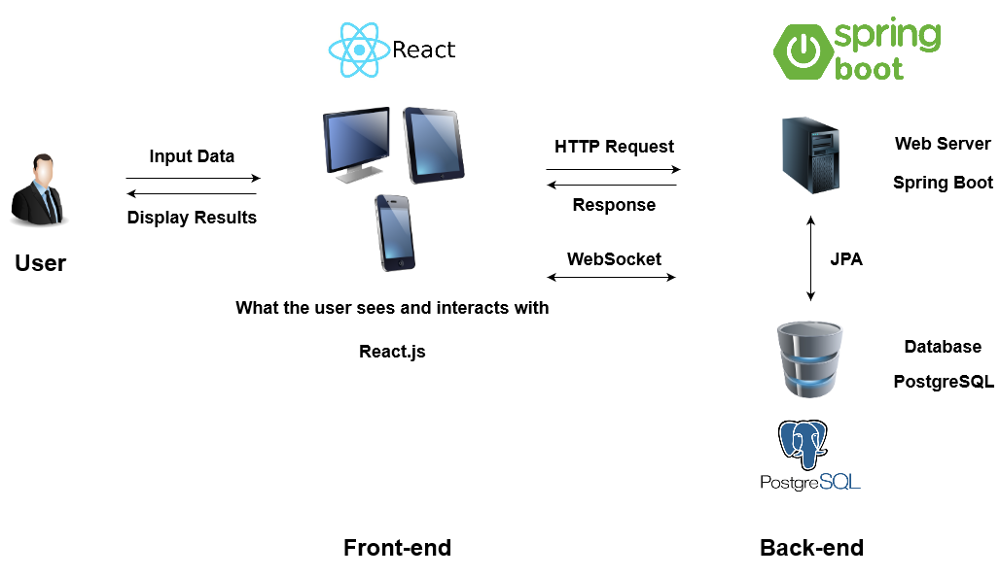
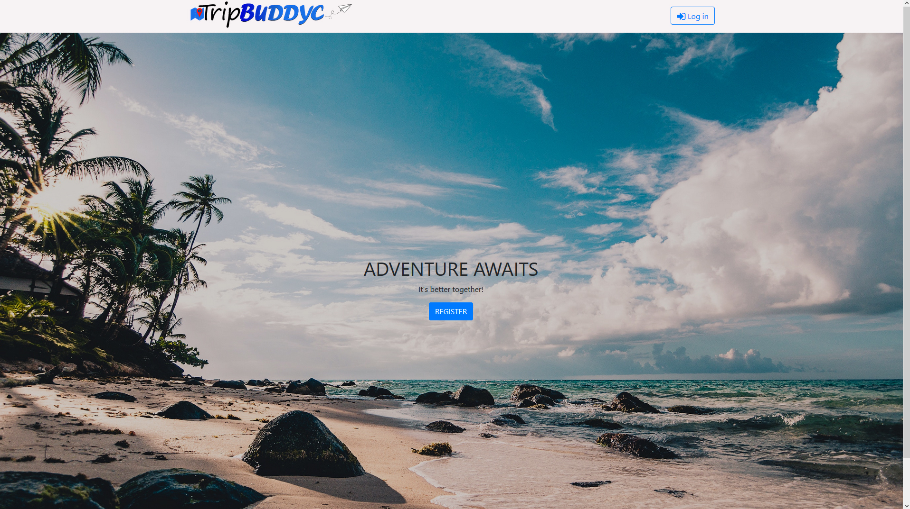
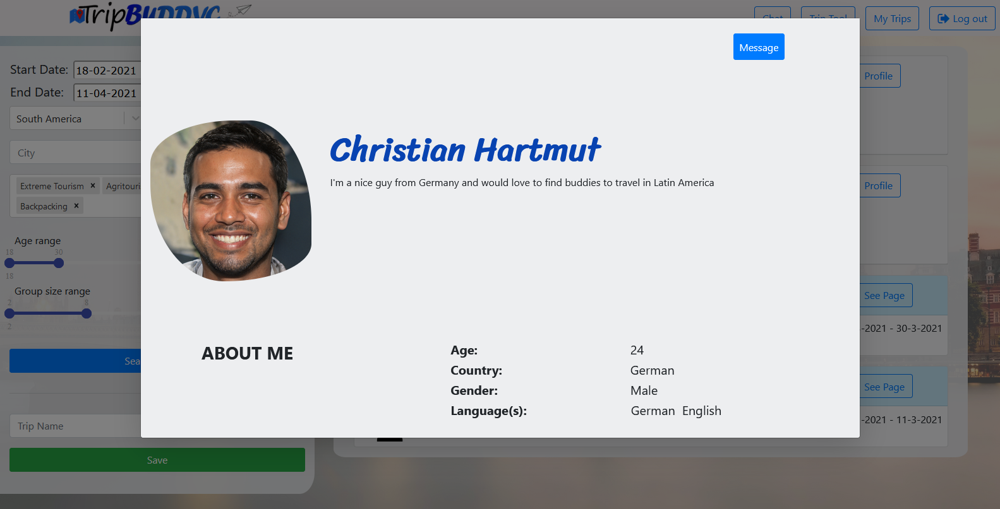
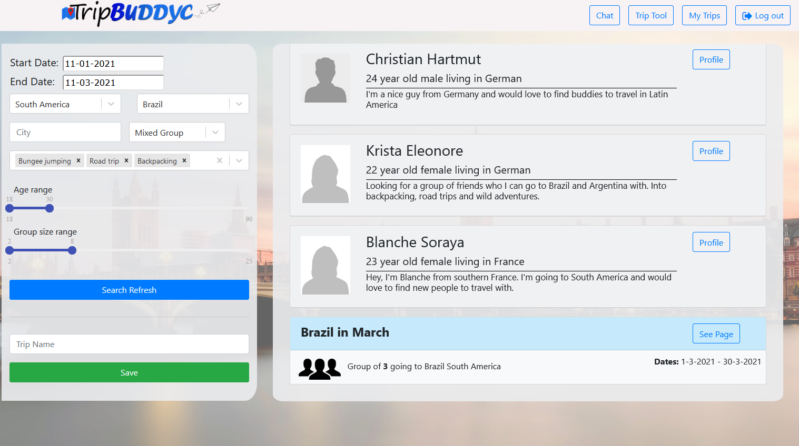
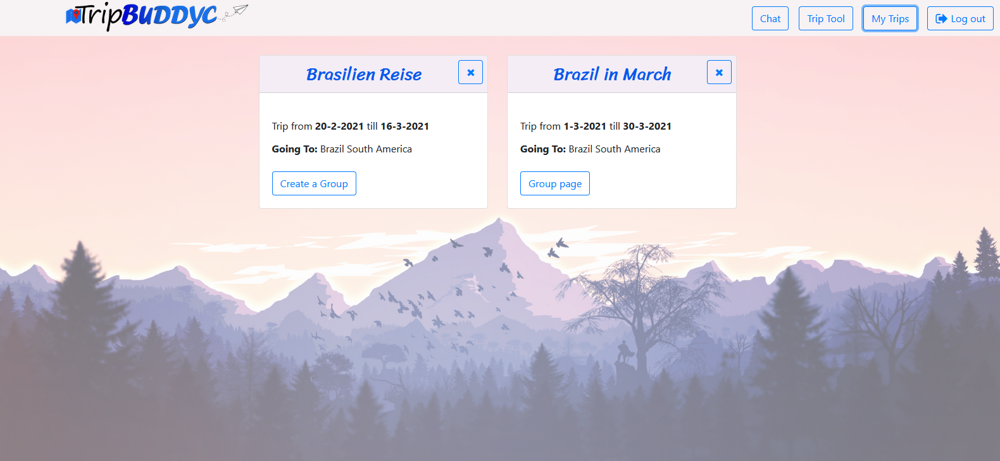
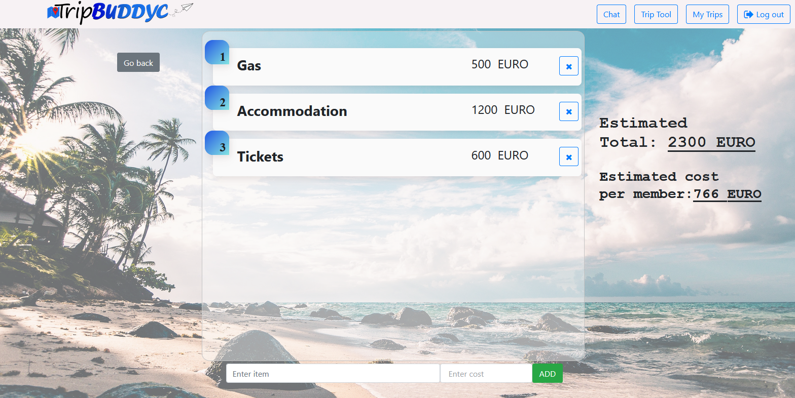
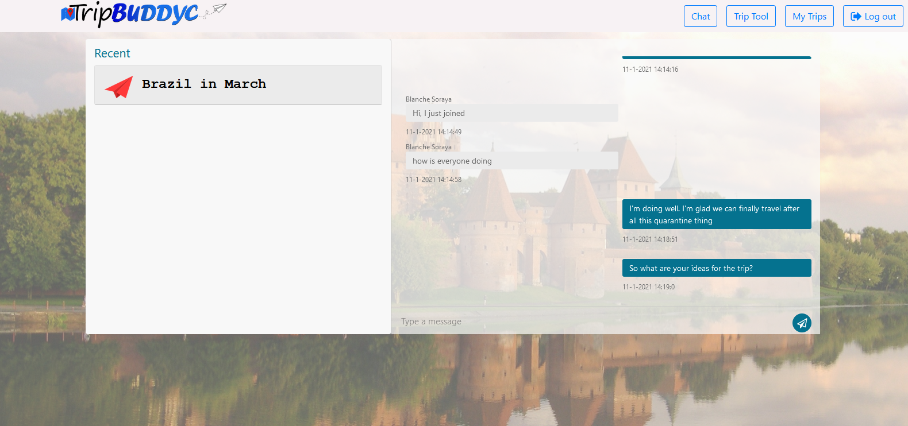

# TripBuddyc Web Application (back-end)

TripBuddyc is an advanced social web application for travelers. Its purpose is to help people find new friends to travel with.

The app was created using React framework for the front-end and Spring Boot framework for the back-end. The application’s data is stored in
a PostgreSQL relational database.

## Table of Contents

* [General Info](#general-information)
* [Technologies Used (interesting from the develeper's point of view)](#technologies-used)
* [Features](#features)
* [Screenshots](#screenshots)
* [Setup](#setup)
* [Contact](#contact)

## General Information

The application was developed in a team of two as a diploma project at Warsaw University of Technology. The idea behind it was to create a
product that would help people find a company to travel with. Users can register, create their own profiles, and plan trips. Based on
the entered data the application matches users with other individuals and groups. If there is a match the app allows to send a private
message to such people and to join existing groups. Users can also create their own groups. Each group has a chat where its members can
plan their trip further.

The picture below shows the architecture of the application:

The app was created using React framework for the front-end and Spring Boot framework for the back-end. The application’s data is stored in
a PostgreSQL relational database. The client and server applications communicate with each other using HTTP and Web Sockets.

In this project, my responsibility was to plan, choose the technology and implement the back-end part of the application. Therefore this
repository only contains the code of the back-end part. However, below you will find screenshots of the final version of the application,
including the front-end part.

## Technologies Used (interesting from the develeper's point of view)

- Spring Boot - framework used to build the server application
- PostgreSQL - relational database used to store application’s data
- Maven - build automation tool
- Spring Security with JSON Web Token - used for user authentication
- Spring Data JPA - used to efficiently connect the Spring application with the relational database
- REST API - used for communication between the client and server applications
- WebSocket - used for instant messaging system, allows for real-time communication between users in the chat
- Docker and Docker Compose - containers were used for easier deployment to the production environment
- CI/CD - GitHub Actions were used to automate the deployment to the production server
- Digital Ocean / Azure - platforms where the application was hosted
- Git - used for version control
- Unit and integration tests

## Features

1. Create new profile – it is the first functionality that is used by a new user. User should
input some personal information such as: name, e-mail address, date of birth, gender, a list
of spoken languages, current country of residency, and a short description about itself.
Apart from that the user needs to input a password which will be later used to log in
into the service. It is also possible to add a profile picture.
2. Display user’s profile – a logged in user can see other users’ profiles. Personal
information about the user shows up, including the profile picture.
3. Add a planned trip – the application allows to add a planned trip to the account. The user needs
to specify some details such as: name, location, date, preferable activities, preferable
group type (male / female only, mixed), group size and age range of its members.
4. Browse trips – a feature that translates user's input into a query that looks for
matching groups and users. It means that the user can browse through existing
groups and profiles that match with given criteria such as: location, date, preferable activities,
preferable group type (male / female only, mixed), group size and age range of its
members. I believe it is the most important feature in the project since it allows
to find other travelers who would like to go to the same location at the same time.
5. Add / join a group – the application allows to create groups for existing trips.
A group associates travelers who are planning to spend their vacation together. Each
group has an owner who has some extra permissions such as: accepting / rejecting
pending users and changing group’s currency. Each member of a group can leave it in any moment.
6. Messaging – the application allows to send messages in a chat. There are two kinds
of chats: private one between two users and a group one. All members of a group can
send and receive messages in a group chat linked with that group. A user who wants
to send a message to another user can do it using a button on the profile page of that person.
7. Add estimated costs – a feature that allows to add estimated costs to a group. The
owner of the group has permission to add and remove the estimated costs and change currency. Each
member of the group can see what the total estimated cost is and how much it is per person.

## Screenshots

*Welcome page of the application*

*An example of a profile page*

*Trip search tool - shows matching profiles and groups for given criteria*

*A list of trips saved by the user*

*Estimated expenses - group members can see the estimated cost of the trip*

*An example of a group chat*

## Setup

To build the Spring Boot application, you must first have a PostgreSQL database running.

To run the application, go to the *backend* folder and run the command:

`mvn spring-boot:run -Dspring-boot.run.arguments="--spring.datasource.url=jdbc:postgresql://localhost:5432/DB_NAME --spring.datasource.username=DB_USERNAME --spring.datasource.password=DB_PASSWORD --demo.app.jwtSecret=JWT_SECRET_KEY"`

You need to specify the following variables:
- Datasource URL
- Database username
- Database password
- Secret for the JWT authentication

## Contact

Created by Rafał Bogdanowicz - feel free to contact me by e-mail: <bogdaraf@gmail.com>